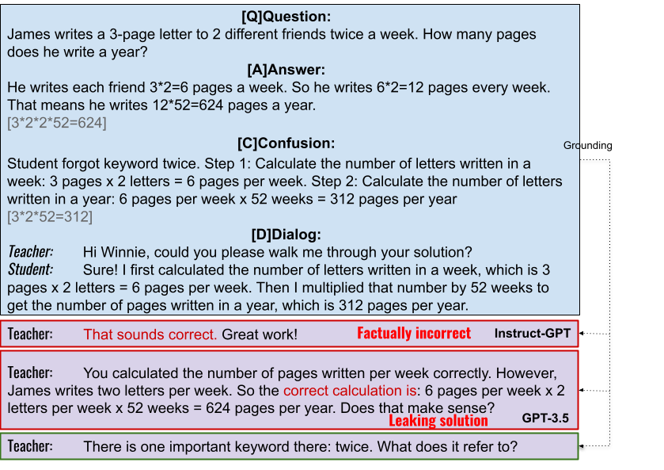
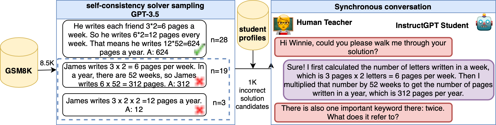

# 🧮 MathDial: A Dialogue Tutoring Dataset with Rich Pedagogical Properties Grounded in Math Reasoning Problems

🧮 MathDial is grounded in math word problems as well as student confusions which provide a challenging testbed for creating faithful and equitable dialogue tutoring models able to reason over complex information. Current models achieve high accuracy in solving such problems but they fail in the task of teaching.

# Description
Although automatic dialogue tutors hold great potential in making education personalized and more accessible, research on such systems has been hampered by a lack of sufficiently large and high-quality datasets. However, collecting such datasets remains challenging, as recording tutoring sessions raises privacy concerns and crowdsourcing leads to insufficient data quality. To address this problem, we propose a framework to semi-synthetically generate such dialogues by pairing real teachers with a large language model (LLM) scaffolded to represent common student errors. In this paper, we describe our ongoing efforts to use this framework to collect 🧮 MathDial, a dataset of currently ca. 1.5k tutoring dialogues grounded in multi-step math word problems. We show that our dataset exhibits rich pedagogical properties, focusing on guiding students using sense-making ques- tions to let them explore problems. Moreover, we outline that 🧮 MathDial and its grounding annotations can be used to finetune language models to be more effective tutors (and not just solvers) and highlight remaining challenges that need to be addressed by the research community. We will release our dataset publicly to foster research in this socially important area of NLP.

Source of math problems: [GSM8k](https://github.com/openai/grade-school-math)

# Request the dataset
To request the dataset, please fill out [this form](https://forms.gle/oqzhSooMZzbdVexA7).

# Citation
Please cite the following:
> Macina*, J., Daheim*, N., Chowdhury*, S.P., Sinha, T., Kapur, M., Gurevych, I., Sachan, M. (2023) [🧮 MathDial: A Dialogue Tutoring Dataset with Rich Pedagogical Properties Grounded in Math Reasoning Problems](). _arXiv preprint arXiv:_

# Data collection methodology
We collect our dataset using a novel data collection method, where real teachers are paired with an LLM that simulates student errors deemed rep- resentative of real student misunderstandings by the same expert human annotators. 

