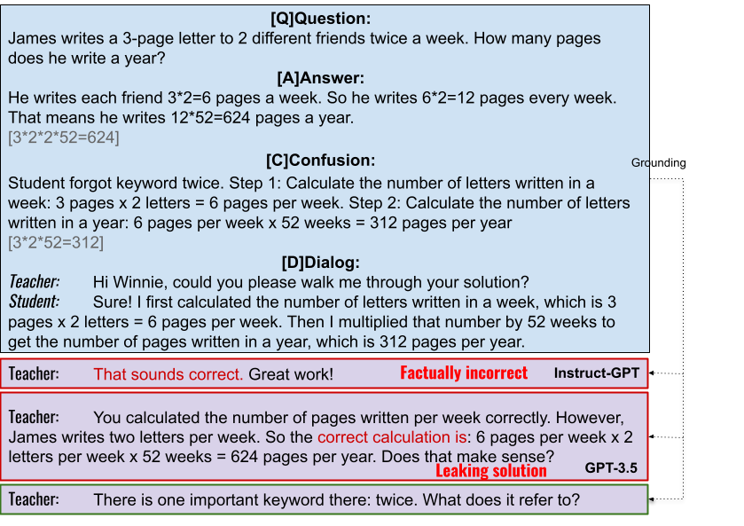

# 🧮 MathDial: A Dialogue Tutoring Dataset with Rich Pedagogical Properties Grounded in Math Reasoning Problems
[ArXiv paper](https://arxiv.org/abs/2305.14536)

[EMNLP 2023 Video](https://s3.amazonaws.com/pf-user-files-01/u-59356/uploads/2023-11-13/6a13y89/mathdial-emnlp23-v5.mp4)

🧮 MathDial is grounded in math word problems as well as student confusions which provide a challenging testbed for creating faithful and equitable dialogue tutoring models able to reason over complex information. 
Current models achieve high accuracy in solving such problems but they fail in the task of teaching.

# Description
>While automatic dialogue tutors hold great potential in making education personalized and
more accessible, research on such systems has been hampered by a lack of sufficiently
large and high-quality datasets. Collecting such datasets remains challenging, as recording
tutoring sessions raises privacy concerns and crowdsourcing leads to insufficient data quality. 
To address this, we propose a framework to generate such dialogues by pairing human teachers 
with a Large Language Model (LLM) prompted to represent common student errors. 
We describe how we use this framework to collect 🧮 MathDial, a dataset of 3k one-to-one
teacher-student tutoring dialogues grounded in multi-step math reasoning problems. While
models like GPT-3 are good problem solvers, they fail at tutoring because they generate factually incorrect feedback or are prone to revealing solutions to students too early. To overcome
this, we let teachers provide learning opportunities to students by guiding them using various
scaffolding questions according to a taxonomy of teacher moves. We demonstrate 🧮 MathDial and its extensive annotations can be used to finetune models to be more effective tutors
(and not just solvers). We confirm this by automatic and human evaluation, notably in an
interactive setting that measures the trade-off between student solving success and telling solutions. 
The dataset is released publicly.


# Dataset
The dataset is available in the data folder. It contains all 2861 conversations. 
The dataset is split into train and test - see `data/train.csv` and `data/test.csv` (for csv format). 
For jsonl format, see `data/train.jsonl` and `data/test.jsonl`. To see a small sample of the dataset, look at `data/example.jsonl`
Please note that each row in the file consists of full conversations between a teacher and a student delimited with special `|EOM|` notation. 

## Data Structure
- `qid` - unique identifier of the problem
- `scenario` - order of the problem in the data collection, out of the 5 scenarios in a session
- `question` - math problem text
- `ground_truth` - correct answer to the problem
- `student_incorrect_solution` - student incorrect solution to the problem caused by some confusion
- `student_profile` - student profile based on general math problem solving student misconceptions
- `teacher_described_confusion` - teacher annotated student confusion in free text
- `self-correctness` - teacher annotated whether student solved the problem correctly by the end of the conversation
    - options: `Yes`, `Yes, but I had to reveal the answer`, `No`
- `self-typical-confusion` - teacher annotated whether student exhibited a typical 7th grade confusion, Likert scale 1 (unlikely) to 5 (very likely)
- `self-typical-interactions` - teacher annotated whether student exhibited typical 7th grade interactions, Likert scale 1 (unlikely) to 5 (very likely)
- `conversation` - conversation in a string format with `|EOM|` delimiter between Teacher and Student personas  `Persona: (dialog_act) text` e.g. `Teacher: (focus) What is the difference?|EOM|Student: I mean ...|EOM|Teacher:`


## HuggingFace Loader

# Setup your environment
```bash 
pip install -r requirements.txt
echo "For implementing teacher and student models, access to OpenAI API is needed." 
export OPENAI_API_KEY="<your-openai-api-key>" 
```

# Teacher model - Generate next tutor response
```bash
python interactivetutoring/gpt_baseline.py --input_file "<dataset-path>" --model_name "<name-of-your-model>" --max_utterances "<stopping-point>" --export_file "<export-file-with-conversations>"
```
Example using ChatGPT3.5 as a teacher model on a small data sample:
```bash
python interactivetutoring/gpt_baseline.py --input_file "data/example.jsonl" --model_name "chatgpt_baseline" --max_utterances 5 --export_file "output/chatgpt_baseline.jsonl"
```
Please see `interactivetutoring/teachers.py` how to add your own teacher model.

# Evaluate your teacher model using simulated student
```bash
python interactivetutoring/evaluate.py --input_file "<path-to-file-with-generations>" --model_name "<model-name>"  
```
Example using dummy data:
```bash
python interactivetutoring/evaluate.py --input_file "output/example_model_output.jsonl" --model_name "chatgpt_baseline"  
```


# Citation
Please cite the following:
> Macina*, J., Daheim*, N., Chowdhury*, S.P., Sinha, T., Kapur, M., Gurevych, I., Sachan, M. (2023) [🧮 MathDial: A Dialogue Tutoring Dataset with Rich Pedagogical Properties Grounded in Math Reasoning Problems](https://arxiv.org/abs/2305.14536). _arXiv preprint arXiv:2305.14536_

# Example

